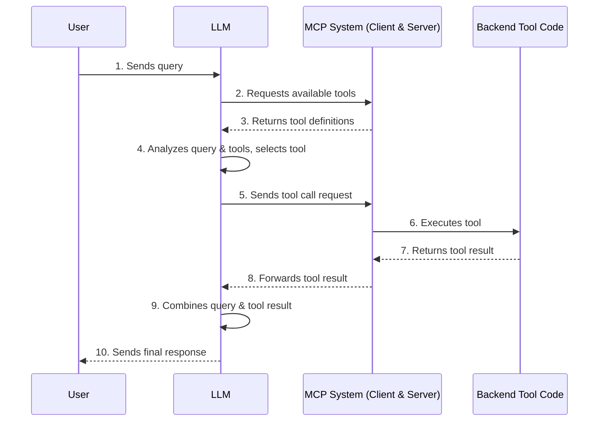

---

# Model Context Protocol (MCP) Server Guide

> Because servers are locally run, MCP currently only supports local call.  

---

## Table of Contents

- [Model Context Protocol (MCP) Server Guide](#model-context-protocol-mcp-server-guide)
  - [Table of Contents](#table-of-contents)
  - [Core MCP Concepts](#core-mcp-concepts)
  - [Set Up Your Environment](#set-up-your-environment)
  - [Building Your Server](#building-your-server)
    - [Import Packages \& Setup](#import-packages--setup)
    - [Helper Functions](#helper-functions)
    - [Implement Tool Execution](#implement-tool-execution)
    - [Running the Server](#running-the-server)
    - [Inspector](#inspector)
  - [How to Let the LLM Call the Server](#how-to-let-the-llm-call-the-server)
  - [What Is the Essence?](#what-is-the-essence)

---

## Core MCP Concepts

MCP servers can provide three main types of capabilities:

1. **Resources**: File-like data that can be read by clients (like API responses or file contents)
2. **Tools**: Functions that can be called by the LLM (with user approval)
3. **Prompts**: Pre-written templates that help users accomplish specific tasks


---

## Set Up Your Environment

First, install `uv` and set up your Python project and environment:

```sh
curl -LsSf https://astral.sh/uv/install.sh | sh
```

> **Note:** Restart your terminal afterwards to ensure the `uv` command is available.

Now, create and set up your project:

```sh
# Create a new directory for our project
uv init weather
cd weather

# Create virtual environment and activate it
uv venv
source .venv/bin/activate

# Install dependencies
uv add "mcp[cli]" httpx

# Create our server file
touch weather.py
```

---

## Building Your Server

### Import Packages & Setup

Add these to the top of your `weather.py`:

```python
from typing import Any
import httpx
from mcp.server.fastmcp import FastMCP

# Initialize FastMCP server
mcp = FastMCP("weather")

# Constants
NWS_API_BASE = "https://api.weather.gov"
USER_AGENT = "weather-app/1.0"
```

> The `FastMCP` class uses Python type hints and docstrings to automatically generate tool definitions, making it easy to create and maintain MCP tools.

---

### Helper Functions

Add helper functions for querying and formatting data from the National Weather Service API:

```python
async def make_nws_request(url: str) -> dict[str, Any] | None:
    """Make a request to the NWS API with proper error handling."""
    headers = {
        "User-Agent": USER_AGENT,
        "Accept": "application/geo+json"
    }
    async with httpx.AsyncClient() as client:
        try:
            response = await client.get(url, headers=headers, timeout=30.0)
            response.raise_for_status()
            return response.json()
        except Exception:
            return None

def format_alert(feature: dict) -> str:
    """Format an alert feature into a readable string."""
    props = feature["properties"]
    return f"""
Event: {props.get('event', 'Unknown')}
Area: {props.get('areaDesc', 'Unknown')}
Severity: {props.get('severity', 'Unknown')}
Description: {props.get('description', 'No description available')}
Instructions: {props.get('instruction', 'No specific instructions provided')}
"""
```

---

### Implement Tool Execution

The tool execution handler is responsible for actually executing the logic of each tool. Add the following:

```python
@mcp.tool()
async def get_alerts(state: str) -> str:
    """Get weather alerts for a US state.

    Args:
        state: Two-letter US state code (e.g. CA, NY)
    """
    url = f"{NWS_API_BASE}/alerts/active/area/{state}"
    data = await make_nws_request(url)

    if not data or "features" not in data:
        return "Unable to fetch alerts or no alerts found."

    if not data["features"]:
        return "No active alerts for this state."

    alerts = [format_alert(feature) for feature in data["features"]]
    return "\n---\n".join(alerts)

@mcp.tool()
async def get_forecast(latitude: float, longitude: float) -> str:
    """Get weather forecast for a location.

    Args:
        latitude: Latitude of the location
        longitude: Longitude of the location
    """
    # First get the forecast grid endpoint
    points_url = f"{NWS_API_BASE}/points/{latitude},{longitude}"
    points_data = await make_nws_request(points_url)

    if not points_data:
        return "Unable to fetch forecast data for this location."

    # Get the forecast URL from the points response
    forecast_url = points_data["properties"]["forecast"]
    forecast_data = await make_nws_request(forecast_url)

    if not forecast_data:
        return "Unable to fetch detailed forecast."

    # Format the periods into a readable forecast
    periods = forecast_data["properties"]["periods"]
    forecasts = []
    for period in periods[:5]:  # Only show next 5 periods
        forecast = f"""
{period['name']}:
Temperature: {period['temperature']}°{period['temperatureUnit']}
Wind: {period['windSpeed']} {period['windDirection']}
Forecast: {period['detailedForecast']}
"""
        forecasts.append(forecast)

    return "\n---\n".join(forecasts)
```

---

### Running the Server

Finally, initialize and run the server:

```python
if __name__ == "__main__":
    # Initialize and run the server
    mcp.run(transport='stdio')
```

---

### Inspector

```zsh
source .venv/bin/activate
mcp dev weather.py
```

NY City: 40.7128° N, 74.0060° W

---

## How to Let the LLM Call the Server

```sh
touch call.py
```

```python
# Create server parameters for stdio connection
import asyncio  # Added import
import json  # Added for pretty printing
from mcp import ClientSession, StdioServerParameters
from mcp.client.stdio import stdio_client
import os
from openai import OpenAI
from litellm import experimental_mcp_client

# Define an async main function
async def main():
    server_params = StdioServerParameters(
        command="python",
        # Make sure to update to the full absolute path to your mcp_server.py file
        args=["./weather.py"],  # Ensure weather.py is in the correct path relative to where 'uv run' is executed
    )

    async with stdio_client(server_params) as (read, write):
        async with ClientSession(read, write) as session:
            # Initialize the connection
            await session.initialize()

            # Get tools using litellm mcp client
            tools = await experimental_mcp_client.load_mcp_tools(session=session, format="openai")
            print("MCP TOOLS: ")
            print(json.dumps(tools, indent=2))

            # Use OpenAI SDK pointed to LiteLLM proxy
            client = OpenAI(
                api_key="sk-8arsIf-JTANRxMMnRkATHA",  # Your LiteLLM proxy API key
                base_url="https://litellm.yibozhang.me"  # Your LiteLLM proxy URL
            )

            messages = [{"role": "user", "content": "tell me the weather alert for NY"}]
            llm_response = client.chat.completions.create(
                model="gpt-4.1",
                messages=messages,
                tools=tools
            )
            print("LLM RESPONSE: ")
            print(json.dumps(llm_response.model_dump(), indent=2))

            # Get the first tool call
            if llm_response.choices[0].message.tool_calls:
                tool_call = llm_response.choices[0].message.tool_calls[0]
                
                # Call the tool using MCP client
                call_result = await experimental_mcp_client.call_openai_tool(
                    session=session,
                    openai_tool=tool_call.model_dump(),
                )
                print("MCP TOOL CALL RESULT: ")
                print(json.dumps(call_result.model_dump_json() if hasattr(call_result, 'model_dump_json') else call_result, indent=2))

                # Send the tool result back to the LLM
                current_message_dump = llm_response.choices[0].message.model_dump()
                messages.append(current_message_dump)
                
                messages.append({
                    "role": "tool",
                    "content": str(call_result.content[0].text) if call_result.content and call_result.content[0].text else "No content from tool",
                    "tool_call_id": tool_call.id,
                })

                final_response = client.chat.completions.create(
                    model="gpt-4.1",
                    messages=messages,
                    tools=tools
                )
                print("FINAL RESPONSE: ")
                print(json.dumps(final_response.model_dump(), indent=2))
            else:
                print("No tool calls made by the LLM.")

# Run the main async function
if __name__ == "__main__":
    asyncio.run(main())
```

---

## What Is the Essence?


