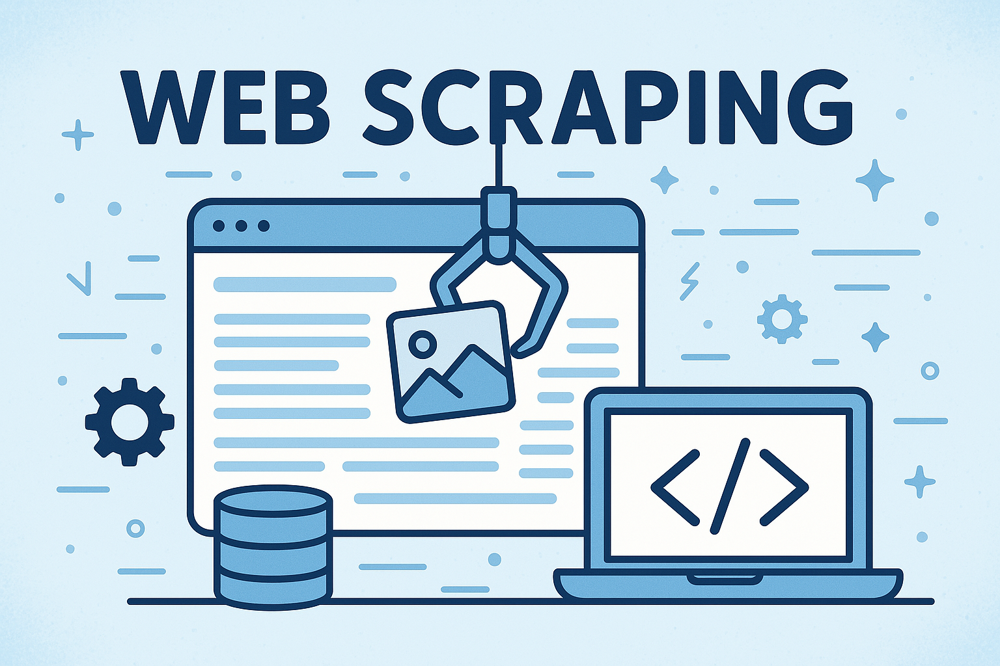

# Web Scraping Tutorial



## Introduction

Web scraping is the process of extracting data from websites. This tutorial will guide you through the basics of web scraping using various tools and techniques.


Let's start with the following example page:

[APS Search Results - Magnetic Materials](https://journals.aps.org/search/results?sort=recent&clauses=%5B%7B%22field%22:%22all%22,%22value%22:%22magnetic%20materials%20%22,%22operator%22:%22AND%22%7D%5D&page=7&per_page=20)

## 1. Selecting DOM Elements

To extract data from web pages, we need to select specific elements. Here are some common methods:


### Common Selector Functions

```javascript
document.querySelector()       // Returns the first element that matches a CSS selector
document.querySelectorAll()    // Returns all elements that match a CSS selector
document.getElementById()      // Returns an element with the specified ID
document.getElementsByClassName() // Returns elements with the specified class name
```

### DOM Manipulation Functions

Once you've selected elements, you can interact with them using these methods:

```javascript
.textContent       // Gets or sets the text content of an element
.innerHTML         // Gets or sets the HTML content of an element
.getAttribute()    // Gets the value of a specified attribute
.setAttribute()    // Sets the value of a specified attribute
.style             // Gets or sets the inline style of an element
.classList         // Manages the element's classes
.addEventListener() // Attaches an event handler to an element
```

### Useful JavaScript Patterns

Here's a common pattern for processing multiple elements:

```javascript
document.querySelectorAll('.article-item').forEach(element => {
    console.log(element.textContent)
})
```

## 2. Making HTTP Requests

### Using cURL

For simple requests, you can use cURL from the command line:


```bash
curl -s -X GET "https://journals.aps.org/search/results?sort=recent&clauses=%5B%7B%22field%22:%22all%22,%22value%22:%22magnetic%20materials%20%22,%22operator%22:%22AND%22%7D%5D&page=7&per_page=20"
```
### HTTP Request Headers

HTTP Headers
```python
headers = {
    'User-Agent': 'Mozilla/5.0 (Windows NT 10.0; Win64; x64) AppleWebKit/537.36 (KHTML, like Gecko) Chrome/108.0.0.0 Safari/537.36'
    'Accept': 'text/html,application/xhtml+xml,application/xml;q=0.9,image/avif,image/webp,image/apng,*/*;q=0.8,application/signed-exchange;v=b3;q=0.9',
    'Accept-Language': 'en-US,en;q=0.9',
}
```

## 3. Browser Automation with Playwright

For more complex scraping tasks, especially with JavaScript-heavy websites, browser automation tools like Playwright are more effective:


Here I will use nodejs as a demo, but you can also use python.

```bash
npm install playwright
```


```javascript
const { chromium } = require('playwright');

(async () => {
  const browser = await chromium.launch({
    headless: false,  // Set to true for production
  });
  const page = await browser.newPage();
  
  try {
    await page.goto('https://journals.aps.org/search/results?sort=recent&clauses=%5B%7B%22field%22:%22all%22,%22value%22:%22magnetic%20materials%20%22,%22operator%22:%22AND%22%7D%5D&page=7&per_page=20');
    
    // Add your scraping or testing logic here
    console.log('Page loaded successfully');
    
    // Wait for the content to load
    await page.waitForSelector('#search-main');
    
    // Select elements and print
    const blocks = await page.$$('#search-main > div > div');
    if (blocks.length > 0) {
      for (let i = 0; i < blocks.length; i++) {
        const textContent = await blocks[i].textContent();
        console.log(`Block ${i} content:`, textContent);
      }
    } else {
      console.log('No blocks found');
    }
    
    // Add a small delay before closing
    await page.waitForTimeout(1000);
    
  } catch (error) {
    console.error('An error occurred:', error);
  } finally {
    await browser.close();
    console.log('Browser closed');
  }
})();   
```

**Note:** Running browser automation scripts can be resource-intensive and may take a long time when processing multiple pages. Additionally, you cannot close your laptop while these scripts are running.

## 4. Running Scripts in the Background with Tmux

To run long-running scripts without keeping your terminal open, you can use Tmux:


### Tmux Commands

| Command | Description |
|---------|-------------|
| `tmux new -s mysession` | Create a new session |
| `tmux attach -t mysession` | Attach to an existing session |
| `tmux detach` | Detach from the current session |
| `tmux ls` | List all sessions |
| `tmux kill-session -t mysession` | Remove a session |


### Example: Long-Running Python Script

Here's an example of a Python script that you might want to run in a Tmux session:

```python
import time
for i in range(1000):
    with open("hello.txt", "a") as f:
        f.write(f"hello {i}\n")
    time.sleep(2)
```

## 5. Database Storage


We previously used CSV to store data but discovered many problems:

- **CSV limitations**: Plain text format, easily modified manually, lacks data validation, may lead to data inconsistency
- **Update challenges**: After updating the database, we cannot directly put the new CSV in the backend without extensive checks to prevent data inconsistency

Therefore, we need to use a database to store data:

### Database Advantages

1. **Scalability**: Can handle large-scale data, supports indexing, query optimization, improves data retrieval speed
2. **Concurrency**: Supports multiple users reading and writing simultaneously, and provides transaction mechanisms to ensure data security and correctness
3. **Query Power**: Supports complex SQL queries, can efficiently filter, sort, aggregate calculations and other operations
4. **Relational Structure**: Supports relationships between tables (such as foreign keys, join queries), suitable for complex data structures


## 6. Best Practices for Web Scraping

1. **Add delays between requests** - Avoid overwhelming the server with too many requests

2. **Use appropriate headers** - Set user-agent and other headers to identify your scraper

3. **Handle errors gracefully** - Implement proper error handling and retries


4. **Store data efficiently** - Consider using databases for large datasets

## Conclusion

Web scraping is a powerful technique for data collection and analysis. By combining the tools and techniques covered in this tutorial, you can build robust web scrapers for various purposes.
